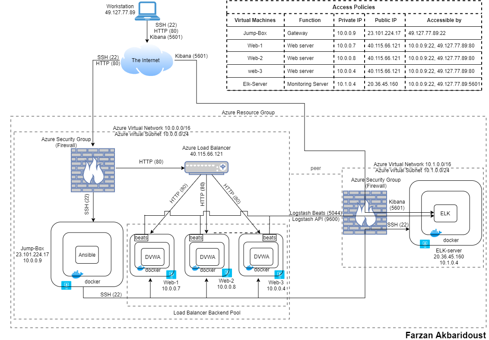

# ELK-Stack
 
Deployment of an ELk-stack docker-container server to monitor a load-balanced instances of DVWA via Filebeat and Metricbeat.

## Automated ELK Stack Deployment

The files in this repository were used to configure the network depicted below.

These files have been tested and used to generate a live ELK deployment on Azure. They can be used to either recreate the entire deployment pictured above. Alternatively, selected portions of the playbook files may be used to install only certain pieces of it, such as Filebeat.

  - [Instal DVWA](Ansible/install-dvwa.yml)
  - [Instal ELk](Ansible/install-elk.yml)
  - [Instal DVWA](Ansible/filebeat-playbook.yml)
  - [Filebeat configuration file](Ansible/filebeat-config.yml)
  - [Instal DVWA](Ansible/metricbeat-playbook.yml)
  - [Metricbeat configuration file](Ansible/metricbeat-config.yml)

This document contains the following details:
- Description of the Topology
- Access Policies
- ELK Configuration
  - Beats in Use
  - Machines Being Monitored
- How to Use the Ansible Build

### Description of the Topology

The main purpose of this network is to expose a load-balanced and monitored instance of DVWA, the Damn Vulnerable Web Application.
Load balancing ensures that the application will be highly available and reliable, in addition to restricting the ranges of the lister ports to the network.
The main advantage of using a load balancer is to improve the availability aspect of the CIA trid in cyber security. A load balancer can benefit the network from multiple aspects, while the following are the advantages that re more common and used here.
 - Highly available web application, if a server goes down, the load balancer transfers the load to another server, making the web application always available. 
 - A load balancer limits the access the from the Internet on specific ports. Here the load balancer only allows access through port 80 http. Therefore, is an attacker can pass the firewall there is another layer of security defending the network. 
- Load balancers also improve the performance of the network by optimising the traffic amongst the web servers by avoiding excessive amount of traffic to a specific we server. They also sometimes cache and compress the traffic.
- Load balancer also assists in the maintenance of the web, by improving the resilience, therefore when a server needs to be repaired the load balancer transfer the traffic to other web servers
- They also allow easier application of the changes to a network infrastructure with out any disruption to the services provided to the users.

Three web VMs containing a docker and a DVWA as a container are located in the same availability set in a load balancer backend pool. A Jump-box VM capable of connecting to the web VMs through SSH protocol is used to configure the web machines. Both the load balancer and the jump-host machine are behind a firewall (Azure security group) which limits the connection to the whole virtual network.
It is only possible to connect to the jump-host from the Internet through SSH and then from the jump-host to the web VMs, to enhance the security the SSH connection is established with keys only. The Web VMs and their DVWA containers are accessible through port 80 (HTTP) for the authorised external IPs.
- What is the advantage of a jump box?_

In another virtual network peered to the networks that web VMs are located, a VM containing an ELK-stack as a container is used to receive the logs from Filebeat and Metricbeat that are installed on the web VMs (using the jump box machine). Similar to the other SSH connection only the jump-host machine is able to connect to configure the ELK-stack server. Also, to monitor the logs using Kibana, the authorized IPs are allow to watch the ELK-stack logs sent through the Filebeat and the Metricbeat over port 5601

Integrating an ELK server allows users to easily monitor the vulnerable VMs for changes to the _____ and system _____.
- _TODO: What does Filebeat watch for?_
- _TODO: What does Metricbeat record?_

The configuration details of each machine may be found below.
_Note: Use the [Markdown Table Generator](http://www.tablesgenerator.com/markdown_tables) to add/remove values from the table_.

| Name     | Function | IP Address | Operating System |
|----------|----------|------------|------------------|
| Jump Box | Gateway  | 10.0.0.1   | Linux            |
| TODO     |          |            |                  |
| TODO     |          |            |                  |
| TODO     |          |            |                  |

### Access Policies

The machines on the internal network are not exposed to the public Internet. 

Only the jump-box machine can accept connections from the Internet. Access to this machine is only allowed from the following IP addresses:
- _TODO: Add whitelisted IP addresses_

Machines within the network can only be accessed by the jump-box machine. 
- _TODO: Which machine did you allow to access your ELK VM? What was its IP address?_

A summary of the access policies in place can be found in the table below.

| Name     | Publicly Accessible | Allowed IP Addresses |
|----------|---------------------|----------------------|
| Jump Box | Yes/No              | 10.0.0.1 10.0.0.2    |
|          |                     |                      |
|          |                     |                      |

### Elk Configuration

Ansible was used to automate configuration of the ELK machine. No configuration was performed manually, which is advantageous because...
- A provisioner is a software application used in IaC setups for making automated configuration changes to computers.
- Provisioners focus on bringing a server to a certain state of operation.
- Once the desired state of a server is documented with code, that code can be run on one server, 100 servers or 10,000 servers within a few minutes. Provisioners can do everything from install software to change configuration text files, and more.
- The changes that a provisioner makes are created using text files, usually written in YAML or JSON.
- When a particular piece of the infrastructure is needed, we can run the code that defines that thing and it will be up and running within a few minutes.
- IaC allows us to clearly build in security protocols from the ground up. If a server is found to be vulnerable, it's easy to change the code that created the server and build in a fix.
- When we create code that contains the configuration of a server, that code can be version controlled and easily audited.
- Rather than having to back up the server and its settings, servers can send logs to a central database. This way, we only need to back up small text files containing the code that defines the servers.
- Code configuration changes can be deployed or reversed as needed. If an update causes a problem, we can use version control to reverse the code to its previous state, and redeploy.
- In order to see what changes are made to a server, we just need to look at what changes the code makes. Often this code is written in a very easy-to-read language, so we only need minimal documentation to understand any given configuration.

The playbook implements the following tasks:
- Installing docker.io ( the docker engine to run containers) using apt, by updating the pat cache first, foring to using apt-get instead of aptitude, and also checking wether the docker.io is installed prior to instalation
- Installing pyhton3-pip (python package manager) using apt, by foring to using apt-get instead of aptitude, and also checking wether the docker.io is installed prior to instalation
- Installing docker module (python client for docker, required by ansible to manage containers) using the pip
- Increasing the virtual memory using Ansible's sysctl for running ELK (persistent on reboots)
- Downloading and launching the version 761 ELK docker conainter developed by sebp (sebp/elk:761)
- Setting the ELK continer to launch on every boot.

The following screenshot displays the result of running `docker ps` after successfully configuring the ELK instance.

### Target Machines & Beats
This ELK server is configured to monitor the following machines:

- All the Web VMs containing the DVWA with the IP Addresses of 10.0.0.7, 10.0.0.8, 10.0.0.4

We have installed the following Beats on these machines:
- Filebeat collects data about the file system. like The logfile audit output is the only output for auditing. It writes data to the <clustername>_audit.json file in the logs directory.
- Metricbea tcollects machine metrics, such as uptime.

These Beats allow us to collect the following information from each machine:
- _TODO: In 1-2 sentences, explain what kind of data each beat collects, and provide 1 example of what you expect to see. E.g., `Winlogbeat` collects Windows logs, which we use to track user logon events, etc._

### Using the Playbook
In order to use the playbook, you will need to have an Ansible control node already configured. Assuming you have such a control node provisioned: 

SSH into the control node and follow the steps below:
- Copy the _____ file to _____.
- Update the _____ file to include...
- Run the playbook, and navigate to ____ to check that the installation worked as expected.

_TODO: Answer the following questions to fill in the blanks:_
- _Which file is the playbook? Where do you copy it?_
- _Which file do you update to make Ansible run the playbook on a specific machine? How do I specify which machine to install the ELK server on versus which to install Filebeat on?_
- _Which URL do you navigate to in order to check that the ELK server is running?

_As a **Bonus**, provide the specific commands the user will need to run to download the playbook, update the files, etc._

https://raw.githubusercontent.com/farzmehr/ELK-Stack/main/Ansible/filebeat-playbook.yml
https://raw.githubusercontent.com/farzmehr/ELK-Stack/main/Ansible/filebeat-config.yml
https://raw.githubusercontent.com/farzmehr/ELK-Stack/main/Ansible/install-elk.yml
https://raw.githubusercontent.com/farzmehr/ELK-Stack/main/Ansible/metricbeat-config.yml