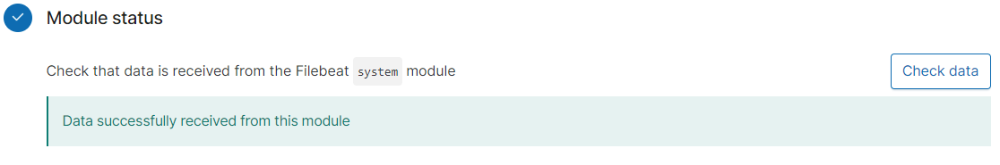

# ELK-Stack Deployment on Microsoft Azure Virtual Network
 
Deployment of an ELK-stack server on a docker-container to monitor load-balanced instances of the Damn Vulnerable Web Application (DVWA) docker-containers via Filebeat and Metricbeat.

## Automated ELK Stack Deployment

The files in this repository were used to configure the network depicted below.

  
This document contains the following details:
- Description of the Topology and Connections
- Access Policies
- Installation and Configuration Using Ansible Playbooks
  - Ansible Container on Jump-box Machine
  - DVWA Containers on Web servers
  - ELK Container on ELK Server
  - Filebeat and Metricbeat on Web Servers
    - Filebeat installation
    - Metricbeat installation
    
The files listed below tested and used to generate live ELK deployment on Microsoft Azure. They can be used to either recreate the entire deployment pictured above or selected portions of the playbook files may be used to install only certain pieces of it, including Filebeat and Metricbeat.

  - [Ansible hosts file configuration](Ansible/hosts)
  - [DVWA playbook: Web VM configuration, Docker engine and DVWA container installation](Ansible/install-dvwa.yml)
  - [ELK playbook: ELK server configuration, Docker engine and ELK container installation](Ansible/install-elk.yml)
  - [Filebeat playbook: Filebeat installation on web servers](Ansible/filebeat-playbook.yml)
  - [Filebeat configuration file](Ansible/filebeat-config.yml)
  - [Metricbeat playbook: Filebeat installation on web servers](Ansible/metricbeat-playbook.yml)
  - [Metricbeat configuration file](Ansible/metricbeat-config.yml)
  
### Description of the Topology and Connections

The main purpose of this network is to expose load-balanced and monitored instances of DVWAs, the Damn Vulnerable Web Applications.

Load balancing ensures that the applications will be highly available and reliable, in addition to restricting the ranges of the listener ports to the network.
The main advantage of using a load balancer is to improve the availability aspect of the cybersecurity CIA triad. A network with a load balancer benefits from multiple aspects, while the following are the more common advantages that are applied here. A load balancer:

- provides highly available web applications. If a server goes down, the load balancer transfers the load to another server, making the web application always available. 
- limits access from the Internet to specific ports. Therefore, if an attacker bypasses the firewall, there is another layer of security defending the network. 
- improves the performance of the network by optimising the traffic amongst the web servers and avoiding excessive amount of traffic to a specific web server. It can also cache and compress the traffic (not used here).
- assists in the maintenance of the web, by improving the resilience of the web server. When a server needs to be repaired, the load balancer transfers the traffic to other web servers.
- allows easier application of the changes to a network infrastructure without any disruption to the services provided to users.

Here, three web virtual machines (VMs) each containing a docker engine and a DVWA instance as a container are in the same Azure availability set within the load balancer backend pool.

A jump-box VM capable of connecting to all the VMs through SSH protocol is used to configure virtual machines. The jump-box provides a clear funnel which the traffic passed through, as a single control point for the infrastructure.
Both the load balancer and the jump-host machine are behind a firewall (Azure security group) which limits the connection to the whole virtual network.
Also, to further enhance the security all the SSH connections are established via keys only.
The only way to connect to the three web VMs via SSH is through the jump-box VM, improving the security by reducing the surface of attack.

In another virtual network peered to the network that web VMs are located, a VM containing an ELK-stack as a container is used to receive the web server logs and metrics organised by Filebeat and Metricbeat, respectively.
Integrating an ELK server allows users to easily monitor the vulnerable VMs for changes to the logs and system metrics. The Beats are installed on the web server hosts directly using the jump-box machine.
The traffic is sent from the Logstash API and the beats on web servers over ports 9600 and 5044, respectively.
Similar to the other SSH connections, only the jump-host machine is able to connect via SSH to, and configure, the ELK-stack server.

In addition to the connection over SSH to the jump-box from the Internet (from whitelisted IP addresses), the Web VMs and their DVWA containers are accessible through port 80 (HTTP) for the external whitelisted IPs through the load balancer.
Also, to monitor the logs using Kibana, the authorized whitelisted IPs are allowed to watch the ELK-stack logs sent through the Filebeat and the Metricbeat over port 5601.

The configuration details of each machine may be found below.

| Name      | Function           | Private IP Address | Public IP Address | Operating System |
|-----------|--------------------|--------------------|-------------------|------------------|
| Jump-Box  | Gateway            | 10.0.0.9           | 23.101.224.17     | Linux Ubuntu     |
| Web-1     | Web server         | 10.0.0.7           | 40.115.66.121     | Linux Ubuntu     |
| Web-2     | Web server         | 10.0.0.8           | 40.115.66.121     | Linux Ubuntu     |
| Web-3     | Web server         | 10.0.0.4           | 40.115.66.121     | Linux Ubuntu     |
| ELK-server| Monitoring server  | 10.1.0.4           | 20.36.45.160      | Linux Ubuntu     |

### Access Policies

The machines on the internal network are not exposed to the public Internet. Only the jump-box machine can accept connections from the Internet. Access to this machine is only allowed from the whitelisted IP addresses (`49.127.77.89` i.e. my workstation IP address)
Also, IP address of anyone who is allowed to configure network can be added to the list in the Azure cloud. Machines within the network can only be accessed by the jump-box machine. 

A summary of the access policies in place can be found in the table below.

| Name      | Accessibility                     | Allowed IP Addresses ports      |
|-----------|-----------------------------------|---------------------------------|
| Jump-Box  | Whitelist (SSH)                   | 49.127.77.89:22                 |
| Web-1     | Jump-Box (SSH), Whitelist (HTTP)  | 10.0.0.9:22, 49.127.77.89:80    |
| Web-2     | Jump-Box (SSH), Whitelist (HTTP)  | 10.0.0.9:22, 49.127.77.89:80    |
| Web-3     | Jump-Box (SSH), Whitelist (HTTP)  | 10.0.0.9:22, 49.127.77.89:80    | 
| ELK-server| Jump-Box (SSH), Whitelist (Kibana)| 10.0.0.9:22, 49.127.77.89:5601  |

### Installation and Configuration Using Ansible Playbooks

#### Ansible Container on Jump-box Machine

Ansible is a provisioner which is used to automate the configuration of VMs here the web and the ELK servers. No configuration is performed manually. This approach is called Infrastructure as code (IaC).
Using Ansible as a provisioner and IaC approach are advantageous for the following reasons:
- Providing automated configuration to machines.
- Bringing a server to a certain state of operation by running one file.
- Running on and configuring multiple (e.g. 10000) servers simultaneously.
- Carrying out different tasks including software installation, editing, and configuring text files.
- Providing an easy version-control and change-tracking.
- Quick redeploying and reversing to a previous state when an update creates a problem.
- Providing easy back-up, as all the settings are saved in simple and small text files.
- Building security protocol from ground-up.
- Easily understandable, as they are usually written in YAML or JSON languages.
- Independency from Linux distribution differences.

In order to use playbooks, first the Ansible control node (jump-box) needs to be configured.

To Install Ansible on the Jump-box, the docker engine (`docker.io`) needs to be installed using:

`sudo apt install docker.io -y` (for a Debian-based Linux)

To check whether `docker.io` is running using `systemctl`:

`sudo systemctl status docker`

Then the Ansible container needs to be pulled from the docker:

`sudo docker pull cyberxsecurity/ansible`

To lunch the Ansible container:

`docker run -ti cyberxsecurity/ansible:latest bash`

From here onwards, to start the container, only the following commands are required:

`sudo docker start <container_name>`

`sudo docker attach <container_name>`

`<container_name>` is given by the system if it is not set by the user (vibrant_davinci in the screenshot below).

To check the status of the running containers. The following command is required

`sudo docker ps`

And similar output shown in the screenshot below should be displayed.
  

#### DVWA Containers on Web servers

[install-dvwa.yml](Ansible/install-dvwa.yml) is the playbook file to install DVWA containers on VMs.
 [install-dvwa.yml](Ansible/install-dvwa.yml) implements the following tasks:
 
- Installing the docker engine to run containers (`docker.io`) using apt, by first updating the apt cache, then forcing to use apt-get instead of aptitude, and also checking whether the `docker.io` is already installed.
- Installing python package manager (`pyhton3-pip`) using apt, by forcing to use apt-get instead of aptitude, and also checking whether the `pyhton3-pip` is already installed.
- Installing Python client for docker (docker module) using `pip`. This is required by ansible to manage containers.
- Downloading and launching the DVWA container developed by cyberxsecurity (`cyberxsecurity/dvwa`) using docker-container.
- Setting the DWWA container to launch on every boot.
- mapping the port 80 on the host to the port 80 on the container

Prior to running the DVWA playbook and installing the DVWA container, the Ansible `hosts` file must be configured.
The Ansible `hosts` configuration file is located on the Ansible container in `/etc/ansible/`.
This step is for allocating machines to different groups, so they can be called when a playbook runs.

Here the machines configured via Ansible need to be added in a single group.
The three web servers are added to the `webservers` group, by adding each IP under `[webservers]`.
Also, when an Ubuntu host is used, the `ansible_python_interpreter=/usr/bin/python3` must be used for each IP address, as Ubuntu 18.04 does not include `/usr/bin/python3` and most Ansible modules are written in Python.
The screenshot of `hosts` file after it is configured is shown below.

To run the playbook and install DVWAs the following steps are required
- SSH into the jump-box
- Start and attach to the Ansible container using

    `sudo docker start <container_name>`

    `sudo docker attach <container_name>`

- Copy [install-dvwa.yml](Ansible/install-dvwa.yml) file to `/etc/ansible/roles/` in the Ansible container by
    
    `curl https://raw.githubusercontent.com/farzmehr/ELK-Stack/main/Ansible/install-dvwa.yml > /etc/ansible/roles/install-dvwa.yml` 
    
- Ensure the [hosts](Ansible/hosts) files in the `/etc/ansible/` is updated based with the web servers IP addresses webservers group as shown above.
- Ensure the web servers are ready by using the Ansible's ping command

    `ansible webservers -m ping`
    
- Run the [install-dvwa.yml](Ansible/install-dvwa.yml) playbook using

   `ansible-playbook /etc/ansible/roles/install-dvwa.Yml`
   
- Navigate to the web servers to check that the installation worked as expected by `sudo docker ps`

Similar output shown in the screenshot below should be displayed.

- Also, to ensure the DVWAs are running properly, inside the web VMs, use

    `curl localhost/setup.php`
    
- Alternatively, use `http://40.115.66.121/setup.php` on a web browser in the whitelisted machine, where `40.115.66.121` is the public IP address of the DVWAs/load balancer. Screenshot shown below shows the DVWAs are successfully running.

#### ELK Container on ELK Server

The ELK server is configured to monitor all the Web VMs containing the DVWA with the IP Addresses of 10.0.0.7, 10.0.0.8, 10.0.0.4.

Here, the ELK playbook implements the following tasks:
 
- Installing the docker engine to run containers (`docker.io`) using apt, by first updating the apt cache, then forcing to use apt-get instead of aptitude, and also checking whether the `docker.io` is already installed.
- Installing python package manager (`pyhton3-pip`) using apt, by forcing to use apt-get instead of aptitude, and also checking whether the `pyhton3-pip` is already installed.
- Installing Python client for docker (docker module) using `pip`. This is required by ansible to manage containers.
- Downloading and launching the version 761 of ELK container developed by sebp (sebp/elk:761) using docker-container.
- Setting the ELK container to start on every boot.
- mapping the port 5601 on the host to the port 5601 on the container for Kibana.
- mapping the port 5044 on the host to the port 5044 on the container for Logstash Beats.
- mapping the port 9600 on the host to the port 9600 on the container for Logstash API.

Similar to DVWA installation, prior to running the ELK playbook and installing the ELK container, the Ansible `/etc/ansible/hosts` file must be configured.

Here, the ELK server configured via Ansible need to be added in another group.
Therefore, the ELK machine added to the ELK group, by adding its IP address under a new group named here `[elk]`.
Similar to DVWA installation, when an Ubuntu host is used, the `ansible_python_interpreter=/usr/bin/python3` must be used for each IP address.
The screenshot of `hosts` file after it is configured is shown below after it is configured.

To run the playbook and install ELK the following steps are required
- SSH into the jump-box
- Start and attach to the Ansible container using

    `sudo docker start <container_name>`

    `sudo docker attach <container_name>`

- Copy [install-elk.yml](Ansible/install-elk.yml) file to `/etc/ansible/roles/` in the Ansible container by

    `curl https://raw.githubusercontent.com/farzmehr/ELK-Stack/main/Ansible/install-elk.yml > /etc/ansible/roles/install-elk.yml` 
    
- Ensure the [hosts](Ansible/hosts) files in the `/etc/ansible/` is updated based with elk IP addresses elk group as shown above.
- Ensure the ELK server is ready by using the Ansible's ping command

    `ansible elk -m ping`
    
- Run the [install-elk.yml](Ansible/install-elk.yml) playbook using

   `ansible-playbook /etc/ansible/roles/install-elk.Yml`
   
- Navigate to the ELK servers to check that the installation worked as expected by

    `sudo docker ps`

Similar output shown in the screenshot below should be displayed.
  

- To visit the ELK interface (Kibana) use `http://20.36.45.160:5601/app/kibana#/home?_g=()` on a web browser in the whitelisted machine, where `20.36.45.160` is the public IP address of the ELK server.
Screenshot shown below shows the ELK is successfully running.

#### Filebeat and Metricbeat on Web Servers

The ELK server is configured to monitor all the Web VMs containing the DVWA with the IP Addresses of 10.0.0.7, 10.0.0.8, 10.0.0.4. The data sent from the web servers to the ELK servers can be organised by Beats.
The Beats are installed on the webservers, while the ELK was installed on the monitoring server.
The following Beats are on the web servers:

- Filebeat specifically collects system log files (e.g. `system.log`, from `/var/log/system.log` and apache server log files from `/var/log/apache2/*`)
    
    - Filebeat collects data about the changes in file systems and the time they are changed, revealing suspicious changes.
     
    - Filebeat assists in organizing log files for sending to Logstash and Elasticsearch.
     
    - Filebeat is often used to watch the logs generated by the webservers including Apache, Microsoft Azure tools, the Nginx web server, and MySQL databases. Here, it is used to monitor the Apache server and MySQL database logs generated by DVWA.
   
-  Metricbeat collects machine metrics, stating how "healthy" a machine is.

   - Metricbeat collects machine metrics, such as uptime and CPU usage.
   
   - Metricbeat collects CPU usage, to alert analysts if CPU usage is too high so failure can be avoided.
   
   - Metricbeat tracks machine uptime providing analysts with the information that they can ensure deployments meet service-level agreements.
 
##### Filebeat installation

Here, the Beats are installed directly on the web server hosts (not the docker). However, they communicate with the ELK container through the docker.
In addition to the playbook file, another file is required to configure each Beat. The file needs to be modified by adding the ELK stack IP address to it, thereby sending the Elastic Search output and the Kibana to the ELK server.  

Here, the Filebeat playbook implements the following tasks:

- Downloading the Filebeat image and installing it on the web servers using `dpkg`. 
- Copying Filebeat configuration file from the Ansible to the webservers.
- Enabling, setting-up and starting the Filebeat module.
- Configuring the Filebeat service to start on each boot.
 
To install the Filebeat the following steps are required:

- SSH into the jump-box
- Start and attach to the Ansible container using

    `sudo docker start <container_name>`

    `sudo docker attach <container_name>`

- Copy [filebeat-playbook.yml](Ansible/filebeat-playbook.yml) file to `/etc/ansible/roles/` in the Ansible container by

    `curl https://raw.githubusercontent.com/farzmehr/ELK-Stack/main/Ansible/filebeat-playbook.yml > /etc/ansible/roles/filebeat-playbook.yml` 

- Copy [filebeat-config.yml](Ansible/filebeat-config.yml) file to `/etc/ansible/files/` in the Ansible container by

    `curl https://raw.githubusercontent.com/farzmehr/ELK-Stack/main/Ansible/filebeat-config.yml > /etc/ansible/files/filebeat-config.yml` 

- Edit the [filebeat-config.yml](Ansible/filebeat-config.yml) and replace the IP address of the Kibana and Elastic Search output to the IP address of the ElK server using `nano /etc/ansible/files/filebeat-config.yml`, as shown below.
 
 Elastic search output:
 
 
 Kibana:
 

- Run the [filebeat-playbook.yml](Ansible/filebeat-playbook.yml) playbook using

   `ansible-playbook /etc/ansible/roles/filebeat-playbook.Yml`
  
- Visit the Kibana again, via `http://20.36.45.160:5601/app/kibana#/home?_g=()` on a web browser in the whitelisted machine, where `20.36.45.160` is the public IP address of the ELK server.
- Click Add Log Data and Choose System Logs and then Click on the DEB tab under Getting Started, and click check data, the screenshot below should be seen.

- Click on System Log Dashboard and similar output shown in the screenshot below should be displayed.

##### Metricbeat installation

Here, the Metricbeat playbook implements the following tasks:

- Downloading the Metricbeat image and installing it on the web servers using `dpkg`. 
- Copying Metricbeat configuration file from the Ansible to the webservers.
- Enabling, setting-up and starting the Metricbeat module.
- Configuring the Metricbeat service to start on each boot.
 
To install the Metricbeat the following steps are required:

- SSH into the jump-box
- Start and attach to the Ansible container using

    `sudo docker start <container_name>`

    `sudo docker attach <container_name>`

- Copy [Metricbeat-playbook.yml](Ansible/Metricbeat-playbook.yml) file to `/etc/ansible/roles/` in the Ansible container by

    `curl https://raw.githubusercontent.com/farzmehr/ELK-Stack/main/Ansible/Metricbeat-playbook.yml > /etc/ansible/roles/Metricbeat-playbook.yml` 

- Copy [Metricbeat-config.yml](Ansible/Metricbeat-config.yml) file to `/etc/ansible/files/` in the Ansible container by

    `curl https://raw.githubusercontent.com/farzmehr/ELK-Stack/main/Ansible/Metricbeat-config.yml > /etc/ansible/files/Metricbeat-config.yml` 

- Edit the [Metricbeat-config.yml](Ansible/Metricbeat-config.yml) and replace the IP address of the Kibana and Elastic Search output to the IP address of the ElK server using `nano /etc/ansible/files/Metricbeat-config.yml`, as shown below.
 
 Elastic search output:
 
 
 Kibana:
 

- Run the [Metricbeat-playbook.yml](Ansible/Metricbeat-playbook.yml) playbook using

   `ansible-playbook /etc/ansible/roles/Metricbeat-playbook.Yml`
  
- Visit the Kibana again, via `http://20.36.45.160:5601/app/kibana#/home?_g=()` on a web browser in the whitelisted machine, where `20.36.45.160` is the public IP address of the ELK server.
- Click Add Log Data and Choose System Logs and then Click on the DEB tab under Getting Started, and click check data, the screenshot below should be seen.

- Click on System Log Dashboard and similar output shown in the screenshot below should be displayed.

Note: To download the files from this repository to the VMs as noted above the `curl` command can be used. For example:

`curl https://raw.githubusercontent.com/farzmehr/ELK-Stack/main/Ansible/Metricbeat-config.yml > /etc/ansible/files/Metricbeat-config.yml` 

However, it is possible to download the files to the local machine and copy them to the VMs via secure shell. The commands below are used to transfer files between two machines remotely connected:

`scp myfile.txt remoteuser@remoteserver:/remote/folder/`

`scp remoteuser@remoteserver:/remote/folder/remotefile.txt  localfile.txt`

Further, to copy files from the VMs to containers the following commands can be used 

`docker cp <containerId>:/file/path/within/container /host/path/target`

`docker cp /host/path/target <containerId>:/file/path/within/container`

